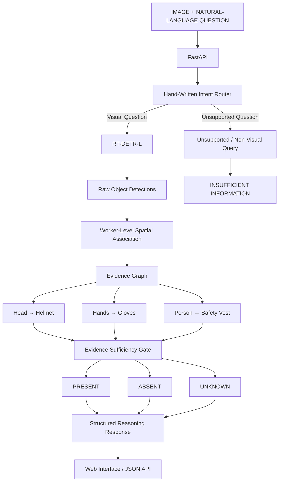

# 🦺 PPE-Sentinel

## Evidence-Grounded Industrial PPE Safety Intelligence

<p align="center">
  <strong>RT-DETR-L · SH17 · Worker-Level Spatial Association · Evidence Sufficiency · Framework-Free Reasoning · FastAPI · ZeroGPU</strong>
</p>

<p align="center">
  An industrial PPE intelligence system that detects workers and safety equipment, associates PPE with individual workers, and determines whether the available visual evidence supports a safety decision.
</p>


---


# 🚀 Live Demo

### 🌐 Interactive Application

**[Open PPE-Sentinel Live Demo](https://rattishkumar-ai-ppe-sentinel.hf.space)**

### 📖 Interactive Swagger API

**[Open FastAPI Swagger Documentation](https://rattishkumar-ai-ppe-sentinel.hf.space/docs)**

### ❤️ API Health

**[Check Deployment Health](https://rattishkumar-ai-ppe-sentinel.hf.space/health)**

### 🤗 Hugging Face Space

**[View PPE-Sentinel on Hugging Face](https://huggingface.co/spaces/Rattishkumar-ai/ppe-sentinel)**

### 💻 Source Code

**[View PPE-Sentinel on GitHub](https://github.com/Rattishaids/ppe-sentinel)**

---

# 🎯 Executive Summary

Industrial PPE monitoring is often treated as a conventional object-detection problem:

> **Detect a helmet. Detect gloves. Detect a safety vest.**

Real safety reasoning is harder.

A detector can fail to see PPE because it is:

* small,
* partially occluded,
* distant,
* visually ambiguous,
* overlapping with another worker,
* or outside the visible body region.

Therefore:

> **PPE not detected does not automatically mean PPE absent.**

PPE-Sentinel separates **perception** from **decision-making**.

The system performs:

```text
IMAGE
  ↓
RT-DETR-L OBJECT DETECTION
  ↓
WORKER-LEVEL SPATIAL ASSOCIATION
  ↓
BODY-REGION / PPE EVIDENCE GRAPH
  ↓
EVIDENCE SUFFICIENCY CHECK
  ↓
PRESENT / ABSENT / UNKNOWN
  ↓
STRUCTURED REASONING
  ↓
FASTAPI / WEB INTERFACE
```

The core design principle is:

> **RT-DETR detects visual evidence. The reasoning layer determines what that evidence actually supports.**

---

# 🏆 Why PPE-Sentinel?

The central problem is not merely:

> **"What objects are in the image?"**

It is:

> **"Can the available visual evidence justify a PPE decision for this worker?"**

PPE-Sentinel therefore distinguishes four outcomes:

| State                          | Meaning                                                                            |
| ------------------------------ | ---------------------------------------------------------------------------------- |
| 🟢 **PRESENT**                 | Sufficient evidence supports the presence of required PPE                          |
| 🔴 **ABSENT**                  | The relevant body region is observable, but required PPE evidence is not supported |
| 🟡 **UNKNOWN**                 | The relevant visual evidence is insufficient or occluded                           |
| ⚪ **INSUFFICIENT INFORMATION** | The requested question cannot be answered from the available visual evidence       |

This explicit uncertainty handling is the primary reasoning contribution of the project.

---

# 📊 Benchmark Scoreboard

## SH17 Validation Benchmark

PPE-Sentinel was evaluated on the official **1,620-image SH17 validation split**.

| Metric               |                               Result |
| -------------------- | -----------------------------------: |
| **Precision**        |                            **75.9%** |
| **Recall**           |                            **68.6%** |
| **mAP@50**           |                            **72.3%** |
| **mAP@50–95**        |                            **47.9%** |
| Validation Images    |                            **1,620** |
| Training Images      |                            **6,479** |
| Object Classes       |                               **17** |
| Model                |                        **RT-DETR-L** |
| Input Resolution     |                        **640 × 640** |
| Batch Size           |                                **4** |
| Epochs               |                               **50** |
| Validation Inference |                    **19.8 ms/image** |
| GPU                  | **NVIDIA RTX 4050 Laptop GPU, 6 GB** |

### What these numbers mean

The detector provides a solid baseline for the full 17-class industrial PPE ontology, but the benchmark also exposes the central challenge of the problem:

> **Small and infrequent PPE categories are substantially harder to detect than large worker/body objects.**

Rather than hiding this limitation, PPE-Sentinel carries it into the reasoning layer and explicitly models uncertainty.

---

# 📉 Training-Data Imbalance

The SH17 training split is strongly imbalanced across PPE categories.

This matters because a detector receives substantially more visual exposure to some object types than others.

## Image-Level PPE Representation in Training

| Class           | Training Images | Percentage of 6,479 Images |
| --------------- | --------------: | -------------------------: |
| **Gloves**      |       **1,067** |                 **16.47%** |
| **Helmet**      |         **373** |                  **5.76%** |
| **Safety Vest** |         **168** |                  **2.59%** |

Therefore:

```text
Gloves       █████████████████  16.47%
Helmet       ██████              5.76%
Safety Vest  ███                 2.59%
```

The safety-vest category appears in only **2.59% of training images**, while gloves appear in **16.47%**.

That is approximately a:

```text
6.36×
```

difference in image-level exposure between gloves and safety vest.

This imbalance is reflected in the detector results.

---

# 📦 Training Instance Distribution

The complete SH17 training dataset contains substantial differences in object-instance frequency.

| Class             | Object Instances |
| ----------------- | ---------------: |
| hands             |           15,850 |
| person            |           13,802 |
| head              |           11,985 |
| face              |            8,950 |
| ear               |            7,730 |
| tools             |            4,647 |
| shoes             |            4,560 |
| gloves            |            2,790 |
| helmet            |              927 |
| foot              |              759 |
| face-mask-medical |              670 |
| safety-vest       |              530 |
| ear-mufs          |              318 |
| safety-suit       |              240 |
| medical-suit      |              157 |
| face-guard        |              134 |

### Critical observation

There are:

```text
15,850 hand instances
vs.
530 safety-vest instances
```

and:

```text
13,802 person instances
vs.
927 helmet instances
```

This creates a major long-tail learning problem.

The project therefore does not interpret the overall mAP as a complete description of PPE compliance capability.

---

# 🎯 PPE-Critical Benchmark

The three primary PPE categories used by the reasoning layer are:

* 🪖 Helmet
* 🧤 Gloves
* 🦺 Safety Vest

| PPE Class       | Precision |    Recall |    mAP@50 | mAP@50–95 |
| --------------- | --------: | --------: | --------: | --------: |
| **Helmet**      | **73.7%** | **77.9%** | **77.7%** | **56.0%** |
| **Gloves**      | **77.6%** | **62.3%** | **68.8%** | **42.3%** |
| **Safety Vest** | **68.3%** | **53.2%** | **56.7%** | **35.6%** |

### Interpretation

**Helmet** is the strongest of the three critical PPE categories by mAP@50.

**Gloves** have higher precision but lower recall, reflecting the difficulty of detecting small hand-mounted PPE.

**Safety vest** is the weakest critical PPE class, which is consistent with its low training representation and the difficult visual conditions of several validation scenes.

This is one of the key findings of the evaluation.

---

# 📐 Small-Object Challenge

PPE detection is particularly sensitive to object scale.

Approximate small-object prevalence in the dataset:

| Category | Small Objects |
| -------- | ------------: |
| Shoes    |        ~87.7% |
| Helmet   |        ~71.5% |
| Gloves   |        ~64.0% |
| Hands    |        ~61.8% |
| Glasses  |        ~70.5% |

Small objects contain fewer pixels and are more vulnerable to:

* downsampling,
* occlusion,
* background similarity,
* motion blur,
* worker distance,
* overlapping objects.

This explains why strong performance on `person`, `head`, and `face` does not automatically translate into equally strong PPE performance.

---

# 🌍 Foreign / OOD Image Evaluation

A responsible benchmark should distinguish **in-distribution validation performance** from **foreign-domain / out-of-distribution performance**.

The reported:

```text
72.3% mAP@50
47.9% mAP@50–95
```

are measured on the SH17 validation distribution.

A formally annotated foreign-domain test set with ground-truth labels was **not established for this submission**, so PPE-Sentinel does **not** claim a numerical foreign-image/OOD accuracy.

| Evaluation Type             | Status                     |
| --------------------------- | -------------------------- |
| SH17 validation             | ✅ Quantitatively evaluated |
| Per-class precision/recall  | ✅ Evaluated                |
| PPE threshold analysis      | ✅ Evaluated                |
| Small-object analysis       | ✅ Evaluated                |
| Failure analysis            | ✅ Evaluated                |
| Foreign/OOD visual examples | ⚠️ Qualitative only        |
| Formal OOD accuracy/mAP     | **Not claimed**            |

This distinction is intentional.

> **An unlabeled foreign image can demonstrate qualitative robustness, but it cannot legitimately produce an accuracy or mAP number.**

A future version should evaluate a separately sourced and annotated construction/industrial PPE dataset as a true external benchmark.

---

# 🏗️ System Architecture




---

# 🔬 Complete Data Flow

```text
                         ┌───────────────────────────┐
                         │      IMAGE + QUERY        │
                         └─────────────┬─────────────┘
                                       │
                                       ▼
                         ┌───────────────────────────┐
                         │         FastAPI           │
                         │   /detect   /reason       │
                         └─────────────┬─────────────┘
                                       │
                                       ▼
                         ┌───────────────────────────┐
                         │ Hand-Written Intent Router│
                         └─────────────┬─────────────┘
                                       │
                         ┌─────────────┴─────────────┐
                         │                           │
                         ▼                           ▼
                 VISUAL QUESTION             UNSUPPORTED QUERY
                         │                           │
                         ▼                           ▼
                 ┌───────────────┐          ┌──────────────────┐
                 │   RT-DETR-L   │          │  INSUFFICIENT    │
                 │    Detector   │          │    INFORMATION   │
                 └───────┬───────┘          └──────────────────┘
                         │
                         ▼
                 ┌───────────────┐
                 │ Raw Detections│
                 │ class/bbox/conf│
                 └───────┬───────┘
                         │
                         ▼
                 ┌───────────────┐
                 │Worker Spatial  │
                 │ Association    │
                 └───────┬───────┘
                         │
                         ▼
                 ┌─────────────────────┐
                 │ Evidence Graph      │
                 │                     │
                 │ Head → Helmet       │
                 │ Hands → Gloves      │
                 │ Person → Vest       │
                 └──────────┬──────────┘
                            │
                            ▼
                 ┌─────────────────────┐
                 │ Evidence Sufficiency│
                 │       Gate          │
                 └──────────┬──────────┘
                            │
                    ┌───────┼───────┐
                    ▼       ▼       ▼
                 PRESENT  ABSENT  UNKNOWN
                    │       │       │
                    └───────┼───────┘
                            ▼
                 ┌─────────────────────┐
                 │ Structured Reasoning│
                 └──────────┬──────────┘
                            │
                            ▼
                 ┌─────────────────────┐
                 │ JSON / Web Response │
                 └─────────────────────┘
```

---

# 👷 Worker-Level PPE Association

A global PPE count is not sufficient for safety compliance.

Consider:

```text
3 workers
2 helmets
```

A global count cannot determine:

> **Which workers have helmets?**

PPE-Sentinel therefore creates worker-level evidence relationships.

```text
Worker 1
│
├── Head
│    └── Helmet
│
├── Hands
│    └── Gloves
│
└── Person
     └── Safety Vest
```

---

# 📐 Spatial Association

Candidate relationships are evaluated using:

* bounding-box containment,
* Intersection over Union (IoU),
* center-point inclusion,
* relative position,
* scale compatibility,
* detector confidence.

The implemented spatial evidence score is:

```text
Spatial Evidence
    =
    45% containment
  + 30% IoU
  + 25% center-inside
```

The association quality combines:

```text
Association Quality
    =
    35% detector confidence
  + 65% spatial evidence
```

The resulting value is an **evidence-strength score**, not a calibrated probability.

---

# 🧩 Evidence Graph

## Helmet

```text
Helmet
   ↓
Head
   ↓
Person
```

## Gloves

```text
Gloves
   ↓
Hands
   ↓
Person
```

## Safety Vest

```text
Safety Vest
      ↓
   Person
```

The directional structure matters because PPE should be evaluated against the body region it is intended to protect.

---

# 🛡️ Evidence Sufficiency

## Helmet Decision Logic

```text
                    Helmet Question
                           │
                           ▼
                    Person detected?
                       /          \
                     NO            YES
                     │              │
                     ▼              ▼
              INSUFFICIENT     Head visible?
                                  /      \
                                NO        YES
                                │          │
                                ▼          ▼
                             UNKNOWN   Helmet evidence?
                                          /       \
                                        YES         NO
                                         │           │
                                         ▼           ▼
                                      PRESENT      ABSENT
```

The same reasoning principle is applied to gloves and safety vest.

---

# 🧠 PRESENT / ABSENT / UNKNOWN

### PRESENT

The system finds sufficient evidence supporting the PPE relationship.

```text
Person
  ↓
Visible body region
  ↓
Associated PPE detected
  ↓
PRESENT
```

### ABSENT

The relevant body region is sufficiently observable, but required PPE evidence is not supported.

```text
Person
  ↓
Relevant region visible
  ↓
No required PPE evidence
  ↓
ABSENT
```

### UNKNOWN

The required body region or evidence is not sufficiently observable.

```text
Person
  ↓
Relevant region occluded
  ↓
Cannot verify PPE
  ↓
UNKNOWN
```

This is the most important distinction between the detector and the reasoning system.

---

# 🧭 Framework-Free Intent Routing

The reasoning layer is implemented using ordinary Python logic.

No agentic framework is used.

```text
❌ LangChain
❌ LangGraph
❌ CrewAI
❌ AutoGen
```

Supported intent categories include:

```text
PPE STATUS
WORKER COUNT
VISUAL SUMMARY
UNSUPPORTED / NON-VISUAL
```

### Example 1 — PPE status

```text
"Are the workers wearing helmets?"
          ↓
     PPE STATUS
          ↓
      RT-DETR
          ↓
 Worker Association
          ↓
 Evidence Sufficiency
          ↓
PRESENT / ABSENT / UNKNOWN
```

### Example 2 — Worker count

```text
"How many workers are there?"
          ↓
     WORKER COUNT
          ↓
 Person detections
          ↓
 Deterministic count
```

### Example 3 — Unsupported question

```text
"What is the weather?"
          ↓
      UNSUPPORTED
          ↓
INSUFFICIENT INFORMATION
```

The reasoning layer does not use a language model to invent visual facts.

---

# 🚦 Insufficient-Information Guardrail

A reliable visual reasoning system must be able to say:

> **"I cannot determine that from this image."**

Example:

```text
Question:
"What is the weather?"
```

Response:

```json
{
  "status": "INSUFFICIENT_INFORMATION",
  "answer": "I cannot answer that question using the available visual detection evidence.",
  "confidence": 0.0
}
```

The same principle applies to visually unobservable attributes.

---

# 🔌 FastAPI API

PPE-Sentinel exposes three primary endpoints.

| Method | Endpoint  | Purpose                                    |
| ------ | --------- | ------------------------------------------ |
| `GET`  | `/health` | Service health                             |
| `POST` | `/detect` | Raw RT-DETR detection                      |
| `POST` | `/reason` | Detection + worker association + reasoning |

---

# 📖 Swagger API

The deployed service provides interactive OpenAPI documentation.

## Swagger UI

**[Open PPE-Sentinel Swagger](https://rattishkumar-ai-ppe-sentinel.hf.space/docs)**

The Swagger interface allows reviewers to test the deployed endpoints directly from the browser.

---

# 🔎 `/detect`

Runs RT-DETR inference on an uploaded image.

```http
POST /detect
Content-Type: multipart/form-data
```

Required field:

```text
image
```

Example response:

```json
{
  "success": true,
  "detection_count": 8,
  "detections": [
    {
      "detection_id": 0,
      "class_id": 0,
      "class_name": "person",
      "confidence": 0.95,
      "bbox": {
        "x1": 120,
        "y1": 80,
        "x2": 520,
        "y2": 760
      }
    }
  ]
}
```

---

# 🧠 `/reason`

Runs the complete reasoning pipeline.

```http
POST /reason
Content-Type: multipart/form-data
```

Parameters:

```text
image
question
```

Example:

```text
Question:
Are the workers wearing helmets?
```

The response exposes:

```text
intent
detection_used
detection_count
worker_count
detections
workers
reasoning
```

This endpoint demonstrates the complete constrained reasoning pipeline.

---

# 🌐 Web Interface

The live interface provides:

* image upload,
* drag-and-drop support,
* bounding-box visualization,
* detection count,
* worker count,
* helmet evidence,
* safety-vest evidence,
* glove evidence,
* natural-language questions,
* quick question controls,
* worker evidence cards,
* evidence-chain visualization,
* raw detection inspection,
* API health status.

### Example live output

```text
Workers detected: 1
Objects detected: 8

Helmet       → PRESENT
Safety Vest  → PRESENT
Gloves       → ABSENT
```

---

# 📚 Dataset — SH17

PPE-Sentinel uses the **SH17 PPE Detection Dataset**.

## Dataset Statistics

| Property                 |      Value |
| ------------------------ | ---------: |
| Images                   |  **8,099** |
| Object Instances         | **75,994** |
| Classes                  |     **17** |
| Training Images          |  **6,479** |
| Validation Images        |  **1,620** |
| Average Instances/Image  |   **9.38** |
| Train/Validation Overlap |      **0** |

## Classes

```text
person
ear
ear-mufs
face
face-guard
face-mask-medical
foot
tools
glasses
gloves
helmet
hands
head
medical-suit
shoes
safety-suit
safety-vest
```

The dataset provides multiple domain-specific PPE categories and is not limited to a COCO-only ontology.

---

# 📎 Dataset Sources

### Official SH17 Repository

https://github.com/ahmadmughees/SH17dataset

### Kaggle Distribution

https://www.kaggle.com/datasets/mugheesahmad/sh17-dataset-for-ppe-detection

### Dataset License

SH17 is distributed under **CC BY-NC-SA 4.0**.

The raw dataset is not redistributed in this repository.

---

# 🔍 Dataset Audit

The dataset preparation pipeline audited:

* image/label correspondence,
* class distribution,
* train/validation split,
* object-scale distribution,
* PPE representation,
* small-object prevalence.

The official split used by the project is:

```text
Training:    6,479 images
Validation:  1,620 images
Overlap:         0 images
```

This ensures that the reported validation metrics are not produced from accidental train/validation image overlap.

---

# ⚙️ Training Configuration

Production model:

```text
Model:              RT-DETR-L
Framework:          Ultralytics
Input Resolution:   640 × 640
Batch Size:         4
Epochs:             50
Checkpoint:         best.pt
```

Hardware:

```text
GPU:                NVIDIA GeForce RTX 4050 Laptop GPU
VRAM:               6 GB
Compute Capability: 8.9
```

Software:

```text
Python:             3.11.16
PyTorch:            2.11.0 + CUDA 12.8
Torchvision:        0.26.0 + CUDA 12.8
Ultralytics:        8.4.149
FastAPI:             0.141.1
Uvicorn:             0.52.4
```

Production checkpoint:

```text
models/ppe_sentinel_rtdetr_l_best.pt
```

The model checkpoint is maintained using Git LFS.

---

# 🧪 Reproducibility

Reproducibility is treated as a core assessment requirement rather than an optional appendix.

```text
reproducibility/
├── environment.md
├── hardware.md
├── training.md
├── dataset.md
└── requirements-lock.txt
```

The documentation records:

* Python version,
* PyTorch/CUDA environment,
* GPU hardware,
* dataset source,
* dataset split,
* model configuration,
* training configuration,
* dependency versions.

The goal is to allow another engineer to reconstruct the experiment without relying on undocumented local configuration.

---

# 🔬 Failure Analysis

PPE-Sentinel performs explicit failure analysis instead of reporting only aggregate metrics.

The validation analysis identified:

* false positives,
* false negatives,
* class confusion,
* small-object failures,
* PPE false negatives,
* PPE false positives,
* weak PPE confidence,
* multi-worker scenes.

PPE-focused analysis identified the following major categories:

| Failure Category        | Interpretation                                          |
| ----------------------- | ------------------------------------------------------- |
| **Multi-worker scene**  | Spatial overlap and worker attribution become difficult |
| **PPE false positive**  | Background/context resembles PPE                        |
| **Weak PPE confidence** | Detector sees ambiguous PPE evidence                    |
| **PPE false negative**  | Required PPE is missed                                  |
| **Small PPE failure**   | Object occupies very few pixels                         |
| **PPE class confusion** | Similar visual appearance between categories            |

---

# 🧪 Five Representative Failure Cases

## 1. Safety-Vest Failure in a Dense Multi-Worker Scene

**Image:** `pexels-photo-12956301.jpeg`

Observed:

```text
Workers:              8
Missed safety vests:  6
Missed gloves:        3
Missed helmets:       1
```

Several safety-vest ground-truth regions occupied extremely small portions of the image.

### Root Cause

The combination of:

* many workers,
* distant workers,
* small vest regions,
* background clutter,

reduces reliable vest localization.

### Implication

Safety vest is currently the weakest critical PPE category and is a priority for future targeted training and higher-resolution experiments.

---

## 2. Helmet Failure on Distant Workers

**Image:** `pexels-photo-14053429.jpeg`

Observed:

```text
Workers:       4
Missed helmets: 3
```

### Root Cause

Helmet regions become extremely small when workers are distant from the camera.

### Implication

The detector's feature resolution becomes a limiting factor.

Potential future improvement:

```text
Higher-resolution training
+
small-object augmentation
+
targeted sampling
```

---

## 3. Glove Failure in a Large Multi-Worker Scene

**Image:** `pexels-photo-7083034.jpeg`

Observed:

```text
Workers:       10
Missed gloves:  6
```

The image also produced multiple PPE false positives.

### Root Cause

Gloves are small objects attached to hands that can be:

* partially hidden,
* overlapped,
* distant,
* visually ambiguous.

### Implication

Glove decisions should depend on the visibility of the hands rather than interpreting missing glove detections as definite absence.

---

## 4. Multi-Worker Spatial Ambiguity

**Image:** `pexels-photo-4966809.jpeg`

Observed:

```text
Workers:             2
PPE false positives: 13
```

### Root Cause

When multiple workers overlap, a PPE object may be spatially close to more than one worker.

A global PPE count therefore cannot establish worker-level compliance.

### Engineering Response

PPE-Sentinel explicitly performs:

```text
PPE
 ↓
Body Region
 ↓
Worker
```

association instead of relying on global object counts.

---

## 5. Occlusion / Insufficient Evidence

A worker may be detected while the body region needed to verify PPE is hidden.

```text
Person detected
       ↓
Head not sufficiently visible
       ↓
Helmet cannot be established
       ↓
UNKNOWN
```

### Root Cause

The information needed for a reliable visual decision is not present in the image.

### Correct Behavior

The system returns:

```text
UNKNOWN
```

rather than:

```text
ABSENT
```

This is a deliberate safety-oriented reasoning behavior.

---

# 📈 PPE Confidence Threshold Analysis

A separate operating-point analysis was performed across confidence thresholds.

| Threshold |  Precision |     Recall |         F1 |
| --------: | ---------: | ---------: | ---------: |
|      0.10 |     18.91% |     83.72% |     30.85% |
|      0.15 |     29.81% |     81.28% |     43.62% |
|      0.20 |     39.14% |     78.08% |     52.14% |
|      0.25 |     47.68% |     75.13% |     58.34% |
|      0.30 |     54.04% |     72.95% |     62.08% |
|      0.35 |     60.66% |     71.15% |     65.49% |
|      0.40 |     65.57% |     69.10% |     67.29% |
|      0.45 |     71.14% |     67.31% |     69.17% |
|  **0.50** | **75.04%** | **65.90%** | **70.17%** |

The aggregate PPE F1 operating point peaked at:

```text
Threshold = 0.50
F1        = 70.17%
```

At that threshold:

```text
Precision = 75.04%
Recall    = 65.90%
F1        = 70.17%
```

This is an **operating-point analysis**, not probability calibration.

---

# 📊 What the Detector Does vs. What the Reasoning Layer Does

| Layer                | Responsibility                           |
| -------------------- | ---------------------------------------- |
| **RT-DETR-L**        | Detect visual objects                    |
| **Detector output**  | Class, bounding box, confidence          |
| **Association**      | Connect PPE to body regions/workers      |
| **Evidence Graph**   | Represent worker-level relationships     |
| **Sufficiency Gate** | Determine whether evidence is observable |
| **Reasoning Layer**  | PRESENT / ABSENT / UNKNOWN               |
| **FastAPI**          | Expose inference and reasoning           |
| **Frontend**         | Visualize evidence and decisions         |

This separation keeps the architecture modular, deterministic, and testable.

---

# 🔐 Constraint Compliance

PPE-Sentinel was implemented under the assignment's constrained architecture.

## No Agentic Frameworks

```text
❌ LangChain
❌ LangGraph
❌ CrewAI
❌ AutoGen
```

## No AutoML

The detector was explicitly configured and fine-tuned rather than selected through an AutoML/no-code workflow.

## Domain-Specific Detection

The model uses SH17's industrial/PPE ontology containing 17 classes.

## Hand-Written Decision Layer

The reasoning system is implemented using explicit Python logic.

## Explicit Abstention

The system can return:

```text
UNKNOWN
```

or:

```text
INSUFFICIENT INFORMATION
```

when visual evidence does not justify a conclusion.

---

# 🧪 Testing

The repository includes tests covering:

```text
tests/
├── test_reasoning.py
├── test_association.py
├── test_evidence.py
└── test_api.py
```

The tests verify:

* intent routing,
* worker counting,
* PPE reasoning,
* PRESENT state,
* ABSENT state,
* UNKNOWN state,
* spatial association,
* evidence handling,
* API behavior.

Run the complete test suite:

```bash
pytest -q
```

---

# 🖥️ Local Quickstart

## 1. Clone

```bash
git clone https://github.com/Rattishaids/ppe-sentinel.git
cd ppe-sentinel
```

## 2. Create Environment

```bash
conda create -n ppe-sentinel python=3.11
conda activate ppe-sentinel
```

## 3. Install Dependencies

```bash
pip install -r requirements.txt
```

## 4. Verify Python Modules

```bash
python -m py_compile api/main.py inference/zerogpu.py app.py
```

## 5. Run Tests

```bash
pytest -q
```

## 6. Start Local FastAPI

```bash
uvicorn api.main:app --host 127.0.0.1 --port 8000
```

Open:

```text
http://127.0.0.1:8000
```

Swagger:

```text
http://127.0.0.1:8000/docs
```

---

# ☁️ Hugging Face Deployment

PPE-Sentinel is deployed as a public Hugging Face Space with GPU-backed inference.

The deployment architecture is:

```text
Internet
   ↓
Hugging Face Space
   ↓
FastAPI / Uvicorn
   ↓
ZeroGPU @spaces.GPU
   ↓
RT-DETR-L
   ↓
Worker Association
   ↓
Evidence Reasoning
   ↓
JSON / Web Response
```

The deployed application is served through the Hugging Face Space environment.

Hugging Face documents **7860 as the default Space application port** for Docker-based deployments.

### Production deployment

**[Open Live PPE-Sentinel](https://rattishkumar-ai-ppe-sentinel.hf.space)**

### Deployment repository

**[Open Hugging Face Space](https://huggingface.co/spaces/Rattishkumar-ai/ppe-sentinel)**

---

# 📂 Repository Structure

```text
ppe-sentinel/
│
├── api/
│   └── main.py
│
├── inference/
│   ├── __init__.py
│   ├── detector.py
│   ├── association.py
│   ├── evidence.py
│   ├── reasoning.py
│   ├── pipeline.py
│   ├── schemas.py
│   └── zerogpu.py
│
├── training/
│   ├── audit_dataset.py
│   ├── prepare_dataset.py
│   ├── train.py
│   ├── evaluate.py
│   ├── analyze_failures.py
│   ├── analyze_ppe_failures.py
│   ├── analyze_ppe_sampling.py
│   ├── build_ppe_balanced_dataset.py
│   └── ...
│
├── frontend/
│   ├── index.html
│   ├── styles.css
│   └── app.js
│
├── configs/
│   ├── dataset.yaml
│   └── experiment.yaml
│
├── models/
│   └── ppe_sentinel_rtdetr_l_best.pt
│
├── outputs/
│   ├── metrics/
│   ├── predictions/
│   ├── failures/
│   └── visualizations/
│
├── tests/
│   ├── test_reasoning.py
│   ├── test_association.py
│   ├── test_evidence.py
│   └── test_api.py
│
├── reproducibility/
│   ├── environment.md
│   ├── hardware.md
│   ├── training.md
│   ├── dataset.md
│   └── requirements-lock.txt
│
├── docs/
│   ├── architecture.md
│   ├── failure_analysis.md
│   └── memo.md
│
├── app.py
├── requirements.txt
├── pytest.ini
└── README.md
```

---

# 📑 Documentation Map

| Resource                                | Purpose                           |
| --------------------------------------- | --------------------------------- |
| `docs/architecture.md`                  | Architecture and system data flow |
| `docs/failure_analysis.md`              | Detailed failure modes            |
| `docs/memo.md`                          | Technical project memo            |
| `reproducibility/environment.md`        | Software environment              |
| `reproducibility/hardware.md`           | Hardware configuration            |
| `reproducibility/training.md`           | Training configuration            |
| `reproducibility/dataset.md`            | Dataset preparation               |
| `reproducibility/requirements-lock.txt` | Dependency versions               |
| `outputs/metrics/`                      | Evaluation artifacts              |
| `outputs/failures/`                     | Failure-analysis artifacts        |
| `outputs/visualizations/`               | Visual evaluation artifacts       |

---

# 🎬 Recommended Reviewer Demo

The fastest way to understand the complete system is:

### Step 1 — Upload an industrial image

Observe:

* worker detections,
* PPE detections,
* bounding boxes,
* confidence values.

### Step 2 — Ask:

```text
Are the workers wearing helmets?
```

Observe worker-level reasoning.

### Step 3 — Ask:

```text
Are the workers wearing gloves?
```

Observe:

```text
PRESENT
ABSENT
UNKNOWN
```

### Step 4 — Ask:

```text
How many workers are there?
```

Observe deterministic worker counting.

### Step 5 — Ask:

```text
What is the weather?
```

Observe:

```text
INSUFFICIENT INFORMATION
```

### Step 6 — Open Swagger

Open:

**https://rattishkumar-ai-ppe-sentinel.hf.space/docs**

The reviewer can independently inspect and invoke:

```text
GET  /health
POST /detect
POST /reason
```

---

# ⚠️ Known Limitations

PPE-Sentinel is intentionally transparent about its limitations.

### 1. Small PPE

Gloves, helmets, glasses, and shoes can occupy very small regions.

### 2. Safety-Vest Recall

Safety vest is currently one of the weaker critical PPE categories.

### 3. Occlusion

A heavily occluded body region may make PPE verification impossible.

The correct system behavior is:

```text
UNKNOWN
```

rather than an unsupported negative claim.

### 4. Dense Multi-Worker Scenes

Spatial association becomes harder as workers overlap.

### 5. Foreign-Domain Generalization

The current submission does not claim a numerical OOD accuracy because a formally annotated foreign-domain test set was not established.

This limitation is explicitly reported rather than replaced with an unsupported benchmark number.

---

# 🔭 Future Work

The architecture provides clear paths for further improvement:

* higher-resolution RT-DETR training,
* small-object augmentation,
* targeted PPE sampling,
* improved worker-to-PPE association,
* temporal tracking,
* video-level reasoning,
* calibrated confidence thresholds,
* stronger occlusion-aware body-region estimation,
* external-domain benchmark evaluation,
* site-specific validation,
* model-drift monitoring.

These improvements can extend the current architecture without replacing its core design:

```text
Detection
    ↓
Association
    ↓
Evidence
    ↓
Decision
```

---

# 🏁 Assessment Coverage

PPE-Sentinel is structured around the complete constrained detection-and-reasoning workflow.

| Assessment Dimension         | Evidence in PPE-Sentinel                            |
| ---------------------------- | --------------------------------------------------- |
| **Object Detection**         | Fine-tuned RT-DETR-L                                |
| **Domain Dataset**           | SH17 industrial PPE dataset                         |
| **Non-COCO Classes**         | Multiple PPE-specific categories                    |
| **Dataset Preparation**      | Audited train/validation split                      |
| **Benchmarking**             | Precision, Recall, mAP@50, mAP@50–95                |
| **Per-Class Analysis**       | Full 17-class metrics                               |
| **Data Imbalance Analysis**  | Image-level and instance-level distribution         |
| **PPE Analysis**             | Helmet / Gloves / Safety Vest metrics               |
| **Small-Object Analysis**    | Object-scale evaluation                             |
| **Threshold Analysis**       | PPE precision/recall/F1 operating points            |
| **Failure Analysis**         | Five representative root-cause cases                |
| **Worker-Level Reasoning**   | Spatial PPE-to-body-region-to-worker association    |
| **Decision Layer**           | Hand-written Python                                 |
| **Uncertainty Handling**     | PRESENT / ABSENT / UNKNOWN                          |
| **Insufficient Information** | Explicit abstention                                 |
| **API**                      | `/detect`, `/reason`, `/health`                     |
| **Interactive API**          | Swagger / OpenAPI                                   |
| **Deployment**               | Public Hugging Face Space                           |
| **Reproducibility**          | Environment + hardware + training + dataset records |
| **Testing**                  | API, reasoning, association, evidence tests         |
| **Engineering Structure**    | Modular training/inference/API/frontend repository  |

---

# 💡 Core Engineering Contribution

PPE-Sentinel is intentionally not presented as:

> **"A model that detects helmets."**

It is presented as:

> **"A constrained visual intelligence system that determines what a PPE image actually provides enough evidence to conclude."**

The architecture explicitly separates:

```text
                 WHAT IS DETECTED
                        ↓
                 WHAT IS ASSOCIATED
                        ↓
                 WHAT IS OBSERVABLE
                        ↓
                 WHAT IS JUSTIFIED
                        ↓
                 WHAT SHOULD BE ANSWERED
```

A detector can be confident about one object while the overall safety decision remains uncertain.

PPE-Sentinel makes that distinction explicit.

---

# 🛡️ Final Principle

> **A safety system should not manufacture certainty from missing evidence.**

Therefore:

```text
DETECT
  ↓
ASSOCIATE
  ↓
VERIFY EVIDENCE
  ↓
REASON
  ↓
PRESENT / ABSENT / UNKNOWN
  ↓
ABSTAIN WHEN NECESSARY
```

---

# 🔗 Final Project Links

| Resource                  | Link                                                                        |
| ------------------------- | --------------------------------------------------------------------------- |
| 🚀 **Live Demo**          | https://rattishkumar-ai-ppe-sentinel.hf.space                               |
| 📖 **Swagger API**        | https://rattishkumar-ai-ppe-sentinel.hf.space/docs                          |
| ❤️ **API Health**         | https://rattishkumar-ai-ppe-sentinel.hf.space/health                        |
| 🤗 **Hugging Face Space** | https://huggingface.co/spaces/Rattishkumar-ai/ppe-sentinel                  |
| 💻 **GitHub Repository**  | https://github.com/Rattishaids/ppe-sentinel                                 |
| 📚 **SH17 Dataset**       | https://github.com/ahmadmughees/SH17dataset                                 |
| 📦 **SH17 Kaggle**        | https://www.kaggle.com/datasets/mugheesahmad/sh17-dataset-for-ppe-detection |

---

<p align="center">
  <strong>🦺 PPE-Sentinel</strong><br>
  Evidence-Grounded Industrial PPE Safety Intelligence
</p>

<p align="center">
  <em>Detect the evidence. Associate the evidence. Verify the evidence. Then decide.</em>
</p>
